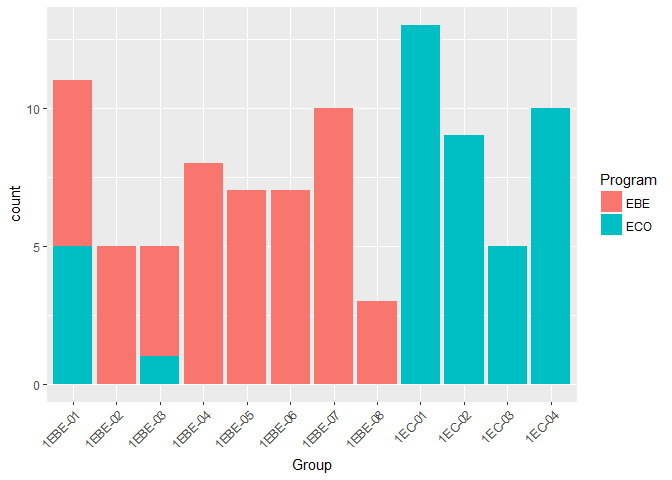
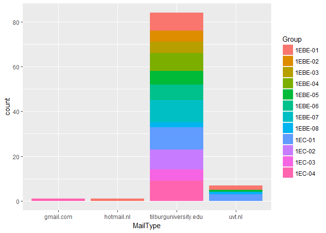
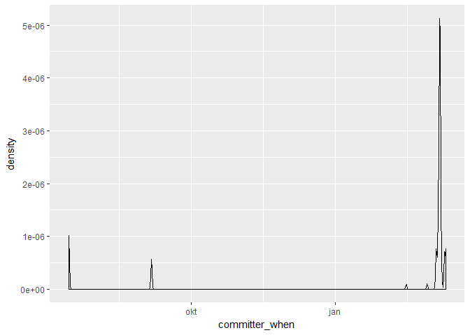

A list with student data
========================

Please make sure you have installed the following R packages to run this demo:

-   xlsx
-   data.table
-   knitr
-   ggplot2
-   git2r

Our source data is an Excel file with names and GitHub repositories of students. This source file is not included in this repository for privacy reasons. To compile this Markdown script, make sure the source file is made available in directory 'sourcedata'.

First we read the source data into a data.table:

``` r
require(xlsx)
require(data.table)

# Import source Excel file
gitData <- read.xlsx2("sourcedata/Programming for Economists (Reacties).xlsx", 1, stringsAsFactors = FALSE)

setDT(gitData)  # convert to data.table
setnames(gitData, colnames(gitData), c("Time", "Name", "ID", "Mail", "Program", "Group", "GitHubUser", "ReadmeLink"))  # better column names
```

We now have a data.table named 'gitData' that we can use for our analysis. First we check for multiple form submissions:

``` r
require(knitr)

gitData <- gitData[, Duplicates := .N, by = "GitHubUser"]
doubleCount <- gitData[, list(Number = .N), by = "Duplicates"]
kable(doubleCount)
```

|  Duplicates|  Number|
|-----------:|-------:|
|           1|      86|
|           2|      14|

So, 14 students submitted the form more than once. To correct for this, we use the latest submitted form as the correct one, leaving 93 unique GitHub users to work with:

``` r
setkey(gitData, Time)  # order by time
gitData <- gitData[, .SD[.N], by = "GitHubUser"]
```

From this data set we can already extract some interesting information:

``` r
require(ggplot2)

ggplot(gitData) +
  geom_bar(aes(Group, fill = Program)) +  # create bar chart
  theme(axis.text.x = element_text(angle = 45, hjust = 1))  # rotate x-axis labels
```



Also, we have different types of email addresses in our lecture group:

``` r
source("DemoAnalysis.R")  # some helper methods defined in companion code file

gitData[, MailType := MailType(Mail)]

ggplot(gitData) + geom_bar(aes(MailType, fill = Group))
```



Apparently, some groups are using the 'uvt.nl' email type more often than others.

Git accounts
============

Now we get to the more challenging part of the analysis; analysing the Git accounts. To do that, we need a clean link to the students git repository, for which we need some work:

``` r
# Correct the repo links
gitData <- CorrectRepoLink(gitData)  # see helper code file for method definition
```

This analysis shows that some students have a different GitHub account name than supplied in the form. These acounts will be excluded from the analysis (remove for privacy?):

``` r
# Correct the repo links
gitData[tolower(GitHubUser) != tolower(GitUserName), list(GitHubUser, GitUserName)]
```

    ##        GitHubUser  GitUserName
    ## 1:      msuppliet     janboone
    ## 2:      Nienked98     janboone
    ## 3: Yana Van Limpt yanavanlimpt

After this exercise, we clone each repository into a local directory and extract some 'commit' information from the clone:

``` r
require(git2r)

gitData <- gitData[tolower(GitHubUser) == tolower(GitUserName)]
gitData <- gitData[, CorrectedRepo := paste(AccountURL, RepoNameCorrected, sep = "/")]

gitCommits <- gitData[, CloneAndExtract(CorrectedRepo, tmpDir = "tmp"), by = "AccountURL,RepoNameCorrected"]
gitCommits <- gitCommits[, Count := 1]
gitCommits <- gitCommits[is.na(message), Count := 0]
commitCount <- gitCommits[, list(NrOfCommits = sum(Count)), by = "AccountURL"]
commitCount <- commitCount[, list(NrOfUsers = .N), by = "NrOfCommits"]
setkey(commitCount, NrOfCommits)
```

With this data-mining operation, the following commit-related information is extracted from GitHub:

| Information       | Sample                                   |
|:------------------|:-----------------------------------------|
| AccountURL        | <https://github.com/Jessica2106>         |
| RepoNameCorrected | Assignments                              |
| sha               | b5c7045c85bb56bbdcb18653e09504d0a6cd6fe0 |
| author\_name      | Minke Remmerswaal                        |
| author\_email     | <s.srisod@tilburguniversity.edu>         |
| author\_when      | 2017-03-08 16:41:34                      |
| committer\_name   | dark2paladin                             |
| committer\_email  | <j.g.ordelmans@tilburguniversity.edu>    |
| committer\_when   | 2017-03-08 16:35:02                      |
| summary           | Initial commit                           |
| message           | Initial commit                           |
| Count             | 1                                        |

Now we can show the number of users per amount of commits, for example

|  NrOfCommits|  NrOfUsers|
|------------:|----------:|
|            0|          2|
|            1|         68|
|            2|          8|
|            3|          4|
|            4|          1|
|            8|          1|
|            9|          1|

We can also show a plot of the density of commits as a function of time

``` r
ggplot(gitCommits[Count > 0]) + geom_density(aes(committer_when))
```



This shows Professor Boone's initial commits and also the fact that a few students actualy committed before the first class (well done!).
